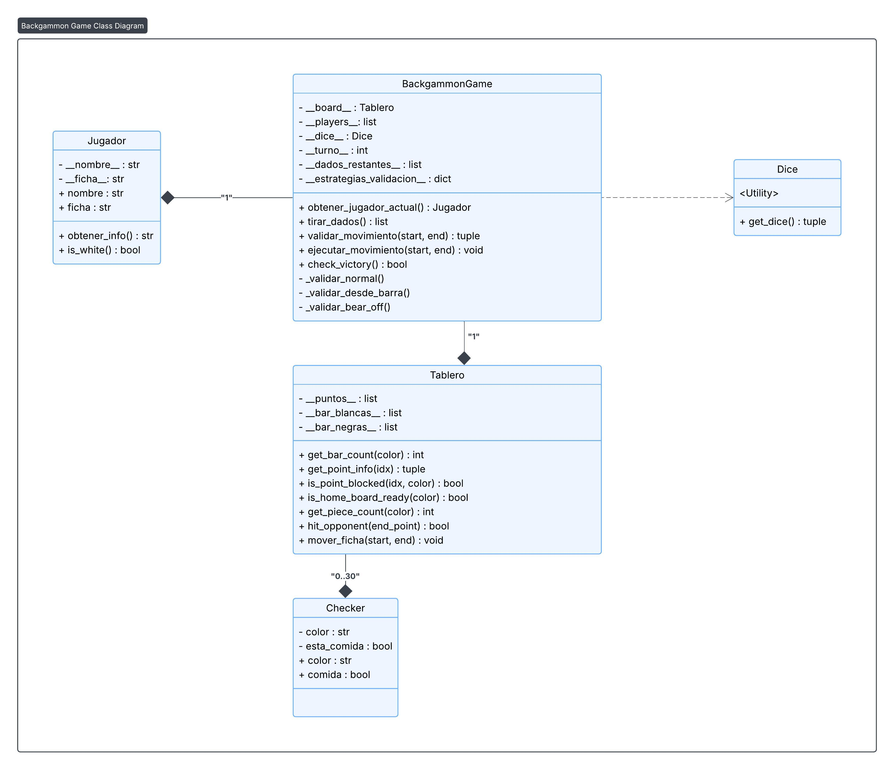

# JUSTIFICACION.MD

Este documento detalla el diseno arquitectonico, las decisiones tecnicas y las estrategias implementadas en el proyecto Backgammon, con el fin de justificar la estructura del codigo y demostrar el cumplimiento de los principios de diseno orientado a objetos.

## 1. Resumen del Diseno General y Flujo de Ejecucion

El proyecto esta construido sobre una arquitectura limpia que impone una estricta **separacion de responsabilidades** entre la logica de negocio (el "core" del juego) y la presentacion (la "interfaz de usuario").

### 1.1. Flujo de Ejecucion

1.  Un punto de entrada (como `if __name__ == "__main__"` en `cli.py` o `pygame_ui.py`) instancia una capa de **Controlador de UI** (`CLIController` o `PygameUI`).
2.  Este controlador de UI instancia el motor del juego: `BackgammonGame` (`src/game/backgammon.py`).
3.  `BackgammonGame` (el "core") a su vez instancia sus dependencias, principalmente `Tablero`.
4.  La UI (ej. `CLIController`) inicia el bucle de juego.
5.  La UI solicita una accion (ej. `tirar_dados`) al `BackgammonGame`.
6.  La UI pide al usuario que ingrese un movimiento.
7.  La UI envia este movimiento (ej. `23 20`) al `BackgammonGame` llamando a `validar_movimiento(23, 20)`.
8.  `BackgammonGame` consulta al `Tablero` sobre el estado (`get_point_info`, `is_point_blocked`) para verificar las reglas.
9.  `BackgammonGame` retorna a la UI una tupla: `(True, None)` o `(False, "Mensaje de error")`.
10. Si es valido, la UI llama a `ejecutar_movimiento(23, 20)`.
11. `BackgammonGame` actualiza sus `__dados_restantes__` y le ordena al `Tablero` que mueva la ficha (`mover_ficha`).
12. La UI (ej. `CLIRenderer`) vuelve a dibujar el estado consultando al `BackgammonGame` y al `Tablero`.

### 1.2. Modulos Clave y Dependencias

* `src/game/` (Logica Central / Modelo):
    * No tiene dependencias de la UI.
    * Contiene las reglas, el estado y las entidades del juego.
    * `backgammon.py` depende de `tablero.py`, `dado.py` y `jugador.py`.
* `src/ui/` (Presentacion / Vista-Controlador):
    * Depende de `src/game/`.
    * Contiene el codigo para renderizar en consola (`cli.py`) o en ventana grafica (`pygame_ui.py`).

Esta separacion asegura que la logica del juego pueda ser probada de forma aislada y que se puedan anadir nuevas interfaces (ej. una API web) sin modificar una sola linea del `src/game/`.

---

## 2. Justificacion de las Clases Elegidas y Principios SOLID

Cada clase fue disenada con una responsabilidad unica (SRP) y se relaciona con otras a traves de interfaces bien definidas (DIP, OCP).

* **`Checker` (`src/game/checker.py`):**
    * **Responsabilidad (SRP):** Representar una unica ficha. Almacena su `color` y su estado `comida` (si esta en la barra).
    * **Justificacion:** Se eligio crear una clase en lugar de usar tipos primitivos (como enteros `+1` o `-1`) para mejorar la legibilidad y la extensibilidad. Al ser un objeto, podemos agregar mas estados en el futuro (ej. `is_bearing_off`) sin refactorizar todo el sistema.

* **`Dado` (`src/game/dado.py`):**
    * **Responsabilidad (SRP):** Encapsular la logica de generacion de numeros aleatorios para la tirada, incluyendo la gestion de dobles.
    * **Justificacion:** Aisla la dependencia de la biblioteca `random` en un solo lugar. Se implementa como una clase de utilidad (solo metodos estaticos) para reforzar que no debe mantener un estado.

* **`Jugador` (`src/game/jugador.py`):**
    * **Responsabilidad (SRP):** Almacenar los datos de un jugador: `nombre` y `ficha` (color 'W' o 'B').
    * **Justificacion:** Sirve como una entidad simple de datos.

* **`Tablero` (`src/game/tablero.py`):**
    * **Responsabilidad (SRP):** Administrar el **estado** de las 24 posiciones (puntos) y las barras. Su responsabilidad *no* es saber las reglas del juego, sino proveer una API para consultar y modificar el estado de las fichas.
    * **Justificacion:** Esta clase es fundamental para el cumplimiento de **DIP (Principio de Inversion de Dependencias)**.
        * **API Publica:** No expone sus atributos internos (como `__puntos__`). En su lugar, ofrece una interfaz publica (`get_point_info`, `is_point_blocked`, `get_bar_count`, `mover_ficha`).
        * **Abstraccion:** `BackgammonGame` no depende de *como* `Tablero` almacena las fichas (una lista de listas), sino de la *abstraccion* de esta API. Si `__puntos__` se cambiara por un diccionario, `BackgammonGame` no necesitaria ninguna modificacion.
    * **Evolucion (SRP):** Esta clase se refactorizo para eliminar responsabilidades de "dibujo" (como `draw()` o `_format_ficha`), que fueron correctamente movidas a `CLIRenderer`.

* **`BackgammonGame` (`src/game/backgammon.py`):**
    * **Responsabilidad (SRP):** Actua como el **orquestador central** de la logica del juego. Gestiona el flujo de turnos y es el unico lugar donde residen las reglas de movimiento.
    * **Justificacion:** Es el "cerebro" que conecta el estado (`Tablero`) con las acciones.
    * **OCP (Principio Abierto/Cerrado):** Se implementa mediante el **Patron Strategy**. En lugar de un metodo `validar_movimiento` monolitico, la clase utiliza un diccionario `__estrategias_validacion__`. Este diccionario mapea un contexto (ej. "normal", "bar", "bear_off") a un metodo de validacion especifico (`_validar_normal`, `_validar_desde_barra`, `_validar_bear_off`). Esto permite anadir nuevas reglas (nuevas estrategias) sin modificar el codigo de validacion existente.

* **`CLIRenderer` y `CLIController` (`src/ui/cli.py`):**
    * **Responsabilidad (SRP):** Se dividio la logica de la CLI en dos clases para seguir un patron **MVC (Modelo-Vista-Controlador)**.
        * `CLIRenderer` (Vista): Su unica responsabilidad es "dibujar" el estado del juego en la consola. Contiene toda la logica de formato de texto.
        * `CLIController` (Controlador): Su responsabilidad es gestionar el bucle de la aplicacion, parsear el `input` del usuario y comunicarse con el modelo (`BackgammonGame`).
    * **Justificacion:** Esta separacion permite probar la logica de control (`CLIController`) independientemente de la salida visual (`CLIRenderer`) y viceversa.

* **`PygameUI` (`src/ui/pygame_ui.py`):**
    * **Responsabilidad (SRP):** Gestionar todo el ciclo de vida, renderizado y manejo de eventos de la interfaz grafica de Pygame.
    * **Justificacion:** Actua como una "capsula" de presentacion completamente independiente. Implementa una **maquina de estados** (`__current_scene__`) para gestionar las diferentes pantallas (Menu, Juego, etc.). Su existencia valida la arquitectura de `src/game/`, ya que demuestra que el nucleo es reutilizable por interfaces fundamentalmente diferentes.

---

## 3. Decisiones de Diseno y Estructuras de Datos

La eleccion de las estructuras de datos fue deliberada para optimizar la claridad y la eficiencia de las operaciones del juego.

* **`Tablero.__puntos__`: `list[list[Checker]]`**
    * **Justificacion:** Se eligio una lista de 24 listas. La lista externa provee acceso indexado O(1) a cada "punto". La lista interna actua como una "pila" (`stack`), lo cual es natural para el Backgammon: las fichas se apilan y se mueven desde la cima. Las operaciones `append()` y `pop()` son O(1) y representan perfectamente "colocar" y "quitar" una ficha.
    * **Alternativa Descartada:** Un diccionario (`{0: [Checker, ...], 1: []}`). Aunque funcional, es menos eficiente y semanticamente menos claro que una lista de tamano fijo que representa una estructura fisica.

* **`BackgammonGame.__dados_restantes__`: `list`**
    * **Justificacion:** Se necesita una coleccion mutable que represente los dados que el jugador aun no ha usado. Una lista es ideal porque la operacion clave es `remove(used_dice)`.
    * **Alternativa Descartada:** Una tupla. Aunque representa la "tirada" inicial, es inmutable y no permitiria "consumir" los dados uno por uno.

* **`BackgammonGame.__estrategias_validacion__`: `dict`**
    * **Justificacion:** Es la implementacion canonica del Patron Strategy. Permite un despacho dinamico O(1) que mapea una clave de cadena (determinada por la logica) a la funcion de validacion correcta. Es limpio, legible y extensible (OCP).

---

## 4. Manejo de Errores

El proyecto distingue claramente entre **errores de validacion (flujo normal)** y **errores de ejecucion (excepciones)**.

* **Validacion (Flujo Normal):**
    * El metodo `validar_movimiento` **no lanza excepciones** para movimientos invalidos. En su lugar, retorna una tupla `(bool, Optional[str])`, por ejemplo, `(False, "El punto de destino (18) esta bloqueado por el oponente.")`.
    * **Justificacion:** Esta decision de diseno es clave. Un movimiento invalido **no es un error excepcional**; es parte del flujo normal del juego. Obligar a la UI a envolver cada validacion en un `try...except` seria ineficiente y verboso. El retorno de tupla es un "contrato" limpio que la UI puede consumir facilmente para mostrar mensajes al usuario.

* **Excepciones (`ValueError`):**
    * Las excepciones se reservan para situaciones que indican un **error de programacion** o un estado invalido e irrecuperable.
    * `ejecutar_movimiento` lanza un `ValueError` si se le pide ejecutar un movimiento que no es valido. Esto es para asegurar que la UI siempre llame a `validar_movimiento` primero.
    * `CLIController.parsear_input` lanza `ValueError` si el formato del texto es incorrecto (ej. "hola 20"). Este error es capturado por el bucle de `realizar_turno` y se maneja como un error de validacion para el usuario.
    * `Dice.get_dice` captura internamente `ValueError` o `TypeError` de `random` y retorna una tupla vacia para evitar que el juego crashee por un fallo en la generacion de dados.

---

## 5. Estrategias de Testing y Cobertura

La estrategia de pruebas fue fundamental para validar la arquitectura y la logica de reglas.

* **Cobertura:**
    * El reporte de cobertura (`REPORTS.md`) muestra un **95% de cobertura total**.
    * **Logica Central (`src/game/`):** La cobertura es **superior al 97%** (97% a 100% en todas las clases). Esto era el objetivo principal, demostrando que las reglas del juego estan probadas de manera exhaustiva.
    * **CLI (`src/ui/cli.py`):** Se alcanzo un **90% de cobertura**, probando la logica de control, el parseo de input y el manejo de errores.

* **Estrategia de Pruebas (Que se probo y por que):**
    * **Pruebas Unitarias Aisladas:** La estrategia clave fue probar cada clase de forma aislada, utilizando `unittest.mock.patch`.
    * **`test_dado.py`:** Se parchea `random.randint` para forzar tiradas (simples, dobles) y asegurar que `get_dice` retorne la tupla correcta. Esto hace los tests deterministas.
    * **`test_backgammon.py`:** Es el conjunto de pruebas mas complejo.
        * **Helpers (`_setup_checkers`):** Se usa un metodo auxiliar para crear escenarios de tablero especificos (`_setup_checkers`). No se puede probar la logica de "bear off" sin antes poner todas las fichas en el "home board".
        * **Prueba de Contratos:** Los tests de `validar_movimiento` verifican que retorne `(True, None)` en casos validos y `(False, "Mensaje de error")` en casos invalidos. Se prueban todos los mensajes de error (barra bloqueada, punto bloqueado, sin dado, etc.).
    * **`test_cli.py`:**
        * **Simulacion de Usuario:** Se parchea `builtins.input` con `side_effect` para simular a un usuario tecleando.
        * **Prueba del Controlador:** Se prueba que `CLIController` maneja correctamente entradas malformadas, movimientos invalidos (retornados por el `BackgammonGame` mockeado) y el flujo de un turno completo.

## 6. Diagrama de Clases (Lógica Central)

El siguiente diagrama de clases ilustra la arquitectura de la lógica central del juego (`src/game/`), mostrando las relaciones y dependencias entre las clases principales.

### Descripción del Diagrama

Este diagrama representa las cinco clases que componen el núcleo lógico del proyecto.

* **`BackgammonGame` (Orquestador Central):**
    * Es la clase principal que dirige el flujo del juego.
    * Mantiene una relación de **Composición** (rombo negro) con sus componentes esenciales: posee una (`"1"`) instancia de `Tablero` y dos (`"*"`, que en la práctica son 2) instancias de `Jugador`.

* **`Tablero` (Modelo de Estado):**
    * Representa el estado del juego.
    * Mantiene una relación de **Composición** (rombo negro) con `Checker`. Un `Tablero` "posee" de 0 a 30 fichas (`"0..30"`).
    * Expone su **API pública** (métodos `get_point_info`, `is_point_blocked`, `mover_ficha`, etc.), que `BackgammonGame` utiliza para consultar y modificar el estado, en lugar de acceder a sus atributos internos.

* **`Dice` (Utilidad):**
    * Es una clase marcada como `<<Utility>>`, lo que indica que no mantiene un estado.
    * `BackgammonGame` tiene una relación de **Dependencia** (flecha punteada) hacia `Dice`, lo que significa que `BackgammonGame` *usa* `Dice` (específicamente, llama a su método estático `get_dice()`).

* **`Jugador` y `Checker` (Entidades):**
    * Son las clases de datos más simples que representan a los actores y piezas del juego.

